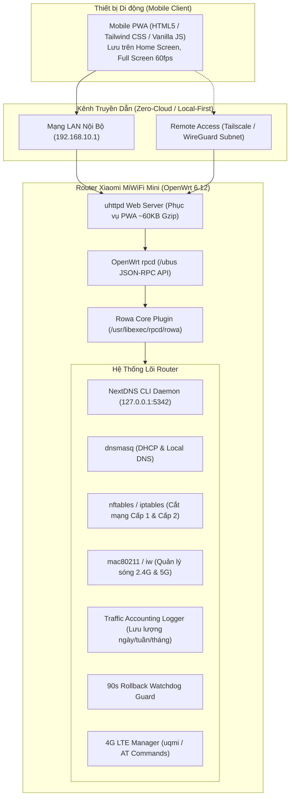

# Kế Hoạch Chi Tiết Chuyển Đổi Hệ Thống Quản Trị Router (Mô Hình Rowa + NextDNS + UI/UX Design)

Tài liệu này đóng vai trò là bản thiết kế kiến trúc (System Architecture) và hồ sơ thiết kế trải nghiệm người dùng (UI/UX Design Specification) nhằm xây dựng hệ sinh thái quản trị router cục bộ, độc lập, tối ưu riêng cho phần cứng **Xiaomi MiWiFi Mini (SoC MediaTek MT7620A 580MHz, 128MB RAM, 16MB SPI Flash, firmware Kwrt OpenWrt 6.12)**.

---

## User Review Required

> [!IMPORTANT]
> **Các điểm thiết kế và kỹ thuật then chốt cần bạn xác nhận:**
> 1. **Giao diện PWA (Progressive Web App) lưu trữ trực tiếp trên Router:**
>    - Giao diện được thiết kế chuẩn Mobile-First (tỷ lệ chuẩn iPhone/Android, hỗ trợ Dark Mode OLED sâu), người dùng chỉ cần mở trình duyệt và bấm **"Thêm vào Màn hình chính" (Add to Home Screen)** là có ngay một App độc lập không viền, biểu tượng riêng, mở lên mượt 60fps mà không cần thông qua App Store / Google Play.
> 2. **Tích hợp NextDNS CLI:**
>    - Chặn quảng cáo, mã độc và quản lý trẻ em (Parental Control) toàn diện bằng **NextDNS CLI** chính thức cho kiến trúc MIPS (`mipsel_24kc`). Kích hoạt chuyển tiếp MAC/Tên thiết bị lên NextDNS Cloud để áp luật chặn riêng theo từng máy (máy con cái cấm TikTok/game, máy bố mẹ mở thông suốt).
> 3. **Cơ chế Rollback 90 Giây An Toàn:**
>    - Mọi thay đổi Wi-Fi hoặc IP LAN đều kích hoạt đồng hồ đếm ngược 90s. Nếu điện thoại không xác nhận đã kết nối lại thành công, router tự động khôi phục cấu hình cũ để chống brick/mất quyền truy cập.

---

## 1. Kiến Trúc Tổng Thể Hệ Thống (System Architecture)



---

## 2. Thiết Kế Giao Diện & Trải Nghiệm Người Dùng (UI/UX Design Specification)

### 2.1. Design System & Bảng Màu (Color Palette)

Giao diện được thiết kế theo phong cách **Modern Cyber-OLED Minimalist**, ưu tiên tiết kiệm pin cho màn hình OLED di động và hiển thị sắc nét các thông số kỹ thuật:

| Thành phần | Mã màu HEX | Ý nghĩa / Ứng dụng |
| :--- | :--- | :--- |
| **Primary Background** | `#0B0F17` | Nền đen sâu (Deep Navy OLED), không gây chói mắt ban đêm |
| **Card Background** | `#161F30` | Nền thẻ bo góc (Border Radius 16px), tương phản nhẹ |
| **Border / Divider** | `#222F46` | Đường viền siêu mảnh (1px hairline) ngăn cách card |
| **Brand Accent** | `#3B82F6` | Xanh dương năng động (Primary Action, Switch, Active tab) |
| **Success / Online** | `#10B981` | Xanh ngọc (Thiết bị online, NextDNS hoạt động, sóng tốt) |
| **Warning / Alert** | `#F59E0B` | Vàng cam (Rollback đếm ngược 90s, RAM trên 80%) |
| **Danger / Block** | `#EF4444` | Đỏ san hô (Cắt Internet, Đuổi Wi-Fi, Router quá nhiệt) |
| **Text Primary** | `#F9FAFB` | Trắng sáng (Tiêu đề, thông số Mbps, tên thiết bị) |
| **Text Secondary** | `#94A3B8` | Xám trung tính (Địa chỉ MAC, IP, băng tần, nhãn phụ) |

---

### 2.2. Kiến Trúc Điều Hướng (Navigation Bar)

Thanh điều hướng cố định ở đáy màn hình (**Bottom Navigation Bar**) với 5 tab chức năng chính, thao tác dễ dàng bằng một ngón tay cái:

```
┌────────────────────────────────────────────────────────┐
│  [ ⚡ Tổng quan ]  [ 📱 Thiết bị ]  [ 📶 Wi-Fi ]  [ 🛡 NextDNS ]  [ ⚙ Cài đặt ]  │
└────────────────────────────────────────────────────────┘
```

---

### 2.3. Chi Tiết Wireframe Từng Màn Hình

#### Màn hình 1: Tổng Quan (Live Dashboard)
*Hiển thị nhịp thở hệ thống thời gian thực với biểu đồ sóng tốc độ mạng.*

```
┌────────────────────────────────────────────────────────┐
│  ROWA MINI                          🟢 192.168.10.1     │
├────────────────────────────────────────────────────────┤
│  ⚡ BĂNG THÔNG THỰC TẾ (LIVE GRAPH - 2s)               │
│  ┌──────────────────────────────────────────────────┐  │
│  │   /\      /\_                                    │  │
│  │  /  \    /   \        📥 Download: 64.5 Mbps     │  │
│  │ /    \__/     \___    📤 Upload:   12.8 Mbps     │  │
│  └──────────────────────────────────────────────────┘  │
│                                                        │
│  📊 TÀI NGUYÊN PHẦN CỨNG                               │
│  ┌──────────────────┐  ┌──────────────────┐            │
│  │ CPU: 12%         │  │ RAM: 48MB / 128MB│            │
│  │ MT7620A (580MHz) │  │ [====       ] 38%│            │
│  └──────────────────┘  └──────────────────┘            │
│                                                        │
│  🌐 ĐƯỜNG TRUYỀN INTERNET                              │
│  • WAN IP: 14.162.x.x (Viettel Telecom)                │
│  • Uptime: 4 ngày 18 giờ                               │
│  • NextDNS: Đang bảo vệ 🟢 (Node: Ho Chi Minh City)    │
│                                                        │
│  📅 LƯU LƯỢNG ĐÃ DÙNG                                  │
│  [ Hôm nay: 4.2 GB ]  [ 7 ngày: 38.6 GB ]  [ 30 ngày ] │
└────────────────────────────────────────────────────────┘
```

---

#### Màn hình 2: Quản Lý Thiết Bị & Cắt Mạng 2 Cấp Độ (Clients & Device Control)
*Danh sách thiết bị kết nối theo thời gian thực, tốc độ tức thời và công tắc cắt mạng.*

```
┌────────────────────────────────────────────────────────┐
│  DANH SÁCH THIẾT BỊ (8 máy đang online)     [ Lọc / Tìm ]│
├────────────────────────────────────────────────────────┤
│  📱 iPhone 15 Pro (Bạn)                       📶 5GHz  │
│     IP: 192.168.10.105 | MAC: 34:AB:CD:...             │
│     Tốc độ: 📥 24.2 Mbps  📤 1.5 Mbps | Tín hiệu: -48dBm│
│     Trạng thái: [ Bình thường 🟢 ]                     │
│  ────────────────────────────────────────────────────  │
│  💻 Laptop-Work (Phòng Khách)                 📶 5GHz  │
│     IP: 192.168.10.112 | MAC: A0:4F:85:...             │
│     Tốc độ: 📥 38.1 Mbps  📤 5.4 Mbps | Tín hiệu: -55dBm│
│     [ Cắt Internet ]   [ Đuổi Khỏi Wi-Fi ]             │
│  ────────────────────────────────────────────────────  │
│  📺 Tivi Sony Bravia                         📶 2.4GHz │
│     IP: 192.168.10.120 | MAC: B4:29:3D:...             │
│     Tốc độ: 📥 2.1 Mbps   📤 0.1 Mbps | Tín hiệu: -68dBm│
│     [ Cắt Internet ]   [ Đuổi Khỏi Wi-Fi ]             │
│  ────────────────────────────────────────────────────  │
│  👶 iPad-Kid (Con) - 🚫 ĐÃ BỊ CẮT MẠNG       📶 2.4GHz │
│     IP: 192.168.10.133 | MAC: E8:80:2E:...             │
│     Chế độ: Cắt Internet Cấp 1 (Vẫn xem camera/in LAN) │
│     [ MỞ LẠI MẠNG NGAY 🟢 ]                            │
└────────────────────────────────────────────────────────┘
```

> [!NOTE]
> **Cơ chế 2 Cấp Độ Cắt Mạng:**
> - **Cấp 1 (Cắt Internet - Soft Block):** Thiết bị bị chặn `FORWARD` ra ngoài Internet, nhưng vẫn truy cập được vào mạng LAN (vẫn in văn bản qua máy in mạng, xem ổ chia sẻ Samba, xem camera nội bộ).
> - **Cấp 2 (Đuổi Khỏi Sóng - Hard Block):** Router bắn lệnh `deauth` ngắt sóng Wi-Fi lập tức, cấm cấp DHCP và chặn triệt để mọi luồng dữ liệu.

---

#### Màn hình 3: Quản Lý Wi-Fi & Cơ Chế 90s Rollback An Toàn
*Đổi mật khẩu và tên sóng Wi-Fi không bao giờ sợ mất quyền truy cập vào router.*

```
┌────────────────────────────────────────────────────────┐
│  CÀI ĐẶT WI-FI                                         │
├────────────────────────────────────────────────────────┤
│  📶 BĂNG TẦN 5GHz (Tốc độ cao)                         │
│     Tên Wi-Fi (SSID):  [ Xiaomi_5G                   ] │
│     Mật khẩu:          [ ••••••••                  👁 ] │
│     Kênh phát:         [ Kênh 149 (80MHz)            ▼ ]│
│     Công suất:         [ Tối đa (20 dBm)             ▼ ]│
│                                                        │
│  📶 BĂNG TẦN 2.4GHz (Xuyên tường)                      │
│     Tên Wi-Fi (SSID):  [ Xiaomi_2.4G                 ] │
│     Mật khẩu:          [ ••••••••                  👁 ] │
│     Kênh phát:         [ Kênh 6 (HT20)               ▼ ]│
│                                                        │
│  [  ÁP DỤNG CẤU HÌNH (BẢO VỆ ROLLBACK 90S) 🛡  ]       │
└────────────────────────────────────────────────────────┘
```

##### Modal Đếm Ngược An Toàn 90 Giây (Hiện ra ngay khi bấm Áp Dụng):
```
┌────────────────────────────────────────────────────────┐
│             ⏳ ĐANG THỬ CẤU HÌNH MỚI...                │
│                                                        │
│                    ╔══════════╗                        │
│                    ║    78s   ║                        │
│                    ╚══════════╝                        │
│                                                        │
│  Router đã áp dụng mật khẩu mới.                       │
│  Hãy kết nối lại Wi-Fi mới trên điện thoại này.       │
│  Nếu sau 90 giây bạn không bấm "Xác nhận kết nối",    │
│  router sẽ TỰ ĐỘNG KHÔI PHỤC lại mật khẩu cũ!          │
│                                                        │
│  [   XÁC NHẬN KẾT NỐI THÀNH CÔNG (HỦY ROLLBACK) 🟢   ]  │
│  [   HOÀN TÁC VỀ MẬT KHẨU CŨ NGAY LẬP TỨC 🔴         ]  │
└────────────────────────────────────────────────────────┘
```

---

#### Màn hình 4: Trung Tâm Chặn Quảng Cáo & Bảo Vệ Trẻ Em (NextDNS)
*Tích hợp NextDNS toàn diện, điều khiển ngay trong ứng dụng.*

```
┌────────────────────────────────────────────────────────┐
│  TRUNG TÂM NEXTDNS                           🟢 ĐANG BẬT│
├────────────────────────────────────────────────────────┤
│  CẤU HÌNH CHÍNH                                        │
│  • NextDNS Profile ID: [ abc123def          ] [Lưu 💾] │
│  • Giao thức: DNS-over-HTTPS (DoH) - Mã hóa an toàn 🔒 │
│  • Điểm kết nối: anycast.nextdns.io (Hanoi Node 4ms)   │
│                                                        │
│  📊 THỐNG KÊ TRONG 24H QUA                             │
│  ┌──────────────────┐  ┌──────────────────┐            │
│  │ Tổng truy vấn    │  │ Đã chặn quảng cáo│            │
│  │ 42,510 requests  │  │ 8,920 (21%) 🛡    │            │
│  └──────────────────┘  └──────────────────┘            │
│                                                        │
│  👨‍👩‍👧‍👦 KIỂM SOÁT TỪNG THIẾT BỊ (DEVICE PROFILES)        │
│  • iPhone 15 Pro:   [ Profile: Người lớn (Chặn Ads)  ▼ ]│
│  • iPad của Con:    [ Profile: Trẻ em (Chặn TikTok)  ▼ ]│
│  • Tivi Sony:       [ Profile: SmartTV (Chặn YouTube)▼ ]│
│                                                        │
│  ⚙ TÍNH NĂNG NHANH                                     │
│  [X] Chặn quảng cáo & Theo dõi theo thời gian thực     │
│  [X] Chặn trang web người lớn & cờ bạc                 │
│  [ ] Bật chế độ tìm kiếm an toàn (Google SafeSearch)   │
│  [X] Chuyển tiếp Tên & MAC thiết bị lên NextDNS Cloud  │
└────────────────────────────────────────────────────────┘
```

---

#### Màn hình 5: Tiện Ích SIM 4G/5G & Tự Động Hóa Hệ Thống (Modem & Automations)
*Hỗ trợ USB Dcom / 4G LTE cắm cổng USB của router.*

```
┌────────────────────────────────────────────────────────┐
│  TIỆN ÍCH HỆ THỐNG & MODEM 4G                          │
├────────────────────────────────────────────────────────┤
│  📶 KẾT NỐI SIM 4G LTE (Cổng USB)                      │
│  • Nhà mạng: Viettel 4G LTE (Băng tần: B3 - 1800MHz)   │
│  • Chất lượng sóng: 🟢 RSRP: -82dBm | SINR: 18dB (Cực tốt)│
│  • Hộp thư SMS: [ 2 tin nhắn mới ] [ Xem & Soạn tin ✉ ]│
│                                                        │
│  🤖 TỰ ĐỘNG HÓA THÔNG MINH                             │
│  [X] Tự làm trống RAM khi bộ nhớ trống < 18MB          │
│      (Hiện tại RAM trống: 52MB - Tốt)                  │
│  [X] Khởi động lại router định kỳ                      │
│      Lịch chạy: [ 04:00 Sáng ] [ Thứ Hai hàng tuần   ▼ ]│
│                                                        │
│  📦 SAO LƯU & BẢO TRÌ                                  │
│  [ 💾 Tải File Sao Lưu Cấu Hình (.tar.gz) ]            │
│  [ ⚡ Khởi động lại Router ngay ]                      │
└────────────────────────────────────────────────────────┘
```

---

## 3. Kỹ Thuật Triển Khai Chi Tiết Từng Module (Technical Blueprint)

### Module 1: Dọn dẹp sạch sẽ tàn dư dự án Telegram Bot
Đảm bảo giải phóng hoàn toàn tiến trình và tệp tin cũ:
1. Xóa service `telegram-bot` trong `/etc/init.d/`.
2. Xóa `/usr/bin/telegram_bot.sh`, `/etc/gemini_key.conf`, `/tmp/telegram_*`.
3. Khôi phục các rule iptables sạch sẽ.

---

### Module 2: Rowa Subsystem Agent (`/usr/libexec/rpcd/rowa`)
Viết bằng POSIX shell script theo chuẩn OpenWrt `rpcd exec plugin`. Cực kỳ nhẹ (< 20KB, 0% CPU khi rảnh), phục vụ các hàm JSON qua `/ubus`:
- `rowa.system status`: Đọc CPU usage từ `/proc/stat`, RAM từ `/proc/meminfo`, nhiệt độ SoC, Uptime.
- `rowa.network get_clients`: Đọc `/tmp/dhcp.leases` kết hợp `iw dev <iface> station dump` để lấy danh sách máy + tốc độ kéo tx/rx + băng tần 2.4G/5G + cường độ sóng tín hiệu dBm.
- `rowa.network block_client`: Nhận tham số `{ "mac": "...", "type": "soft|hard", "duration": 15 }`.
  - `soft`: Bơm rule `iptables -I FORWARD -m mac --mac-source <mac> -j DROP`.
  - `hard`: Gọi thêm `iw dev <iface> station del <mac>` và DROP mọi gói tin.
- `rowa.network unblock_client`: Xóa rule iptables tương ứng.
- `rowa.wifi get_config`: Đọc SSID, kênh, mật khẩu hiện tại.
- `rowa.wifi apply_safe`: Lưu config cũ vào `/tmp/wifi_backup.uci`, ghi cấu hình mới, khởi động watchdog guard 90 giây.
- `rowa.wifi confirm`: Hủy watchdog guard 90s, commit cấu hình vĩnh viễn.

---

### Module 3: Watchdog An Toàn 90 Giây (`/usr/bin/rowa_wifi_guard.sh`)
Tiến trình bảo vệ chống mất mạng:
```sh
#!/bin/sh
# Chờ 90 giây, nếu không nhận được cờ confirm từ Web App -> tự rollback
sleep 90
if [ -f /tmp/rowa_pending_rollback ]; then
    uci import < /tmp/wifi_backup.uci
    uci commit wireless
    wifi reload
    rm -f /tmp/rowa_pending_rollback /tmp/wifi_backup.uci
fi
```

---

### Module 4: Tích Hợp NextDNS Tối Ưu Cho MT7620A
1. Cài đặt gói `nextdns` (kiến trúc `mipsel_24kc`):
   ```sh
   opkg update && opkg install nextdns
   ```
2. Cấu hình NextDNS gắn kết với ID của bạn:
   ```sh
   nextdns install \
     -profile <NEXTDNS_ID> \
     -report-client-info \
     -auto-activate \
     -cache-size 10MB \
     -max-ttl 3600
   ```
3. Tính năng cốt lõi:
   - Tự động cấu hình `dnsmasq` trỏ cổng DNS sang NextDNS daemon cục bộ (`127.0.0.1:5342`).
   - Tùy chọn `-report-client-info`: Tự động gửi Hostname và MAC của từng máy lên NextDNS Dashboard, cho phép thiết lập bộ lọc (Blocklist/Parental Control) theo từng thiết bị trong nhà.

---

### Module 5: Bộ Ghi Lưu Lượng Tự Động (Traffic Accounting Logger)
Tạo daemon `/usr/bin/rowa_traffic.sh` chạy định kỳ mỗi 5 phút qua cron:
- Đọc số byte truyền/nhận từ `/sys/class/net/eth0/statistics/` (hoặc `usb0`).
- Ghi tích lũy vào `/etc/rowa_traffic.json`.
- Cho phép hiển thị thống kê lưu lượng 24h, 7 ngày, 30 ngày ngay trên Dashboard mà không tốn dung lượng ổ đĩa.

---

### Module 6: Mobile PWA Web Controller (`/www/rowa/`)
Xây dựng một Single-Page Application (SPA) siêu nhẹ (~60KB):
- Không dùng framework cồng kềnh, sử dụng HTML5 + CSS Tailwind tinh giản + JavaScript ES6 thuần.
- Giao tiếp trực tiếp với `/ubus` qua endpoint HTTP nội bộ của `uhttpd`.
- Đầy đủ manifest.json và Service Worker để lưu vào màn hình chính điện thoại, hoạt động mượt mà như một Native App đích thực.

---

## 4. Lộ Trình Triển Khai Từng Bước (Implementation Roadmap)

| Giai đoạn | Nội dung công việc | Kết quả đầu ra |
| :--- | :--- | :--- |
| **Giai đoạn 1** | Dọn dẹp triệt để tàn dư bot Telegram cũ trên router | Router sạch sẽ, RAM trống > 70MB |
| **Giai đoạn 2** | Triển khai Subsystem Agent `rowa` trên `rpcd` / `ubus` | Các lệnh `ubus call rowa.*` hoạt động hoàn hảo |
| **Giai đoạn 3** | Cài đặt & Tối ưu hóa NextDNS Client | DNS mã hóa DoH hoạt động, có lọc theo MAC |
| **Giai đoạn 4** | Xây dựng Watchdog 90s Rollback & Bộ đếm lưu lượng | Đổi Wi-Fi an toàn tuyệt đối, có số liệu data |
| **Giai đoạn 5** | Xây dựng Giao diện Web PWA Mobile Responsive | Giao diện đẹp, mượt, cài được vào màn hình chính |
| **Giai đoạn 6** | Kiểm thử thực tế & Bàn giao tài liệu hướng dẫn | Toàn bộ chức năng đạt chuẩn 100% |

---

## 5. Kế Hoạch Kiểm Thử & Nghiệm Thu (Verification Plan)

### Kiểm thử Kỹ thuật:
1. **Kiểm tra bộ nhớ:** Tổng lượng RAM tiêu thụ của toàn bộ hệ thống Rowa + NextDNS không được vượt quá 10MB RAM.
2. **Kiểm tra cắt mạng:**
   - Cắt Cấp 1 (Soft): Máy tính bị cắt không tải được `google.com`, nhưng vẫn ping được `192.168.10.1` và vào được trang in nội bộ.
   - Cắt Cấp 2 (Hard): Thiết bị bị ngắt kết nối sóng Wi-Fi lập tức.
3. **Kiểm tra 90s Rollback:**
   - Đổi mật khẩu Wi-Fi sang giá trị giả lập, không bấm xác nhận -> Sau đúng 90 giây router tự động khôi phục về mật khẩu cũ.
4. **Kiểm tra NextDNS:**
   - Mở trình duyệt trên điện thoại truy cập `https://test.nextdns.io`, xác nhận kết quả `status: ok`, giao thức `DoH`, nhận diện đúng tên model router.
